# TryHackMe — Active Directory Basics | Lab Write-Up
 
> **Room:** Active Directory Basics    
> **Author:** Beatriz Martins | [GitHub](https://github.com/beatrizmartinsc) | [LinkedIn](https://linkedin.com/in/beatriz-martins-cybersecurity)

---

## Overview

This lab introduces the core concepts and administrative tasks involved in managing a Windows Active Directory (AD) environment. Working as a simulated IT administrator for the fictional company **THM Inc.**, I performed hands-on tasks including reorganising Organisational Units (OUs), managing user accounts, delegating administrative control, configuring Group Policy Objects (GPOs), and exploring authentication protocols used in Windows domains.

Active Directory is foundational knowledge for both IT support and cybersecurity roles. Understanding how AD is structured, and how it can be misconfigured, is directly relevant to SOC analysis, where AD-related attacks such as privilege escalation, pass-the-hash, and Kerberoasting are commonly encountered.

---

## Objectives

- Understand the structure and purpose of Active Directory and Windows Domains
- Navigate and manage Organisational Units (OUs), users, and groups using ADUC
- Apply the principle of least privilege through delegation of control
- Create and link Group Policy Objects (GPOs) to enforce security baselines
- Understand how Kerberos and NetNTLM authentication work in a domain environment
- Explore AD object types: users, machines, security groups, and service accounts

---

## Lab Environment

| Detail | Value |
|--------|-------|
| Platform | TryHackMe (browser-based VM) |
| Domain | ADBASICS.thm.local |
| Domain Controller OS | Windows Server (pre-configured) |
| Primary Tool | Active Directory Users and Computers (ADUC) |
| Secondary Tools | Group Policy Management Console, Windows PowerShell |
| Access Method | Remote Desktop Protocol (RDP) |
| Lab Type | Guided hands-on simulation |

---

## Key Concepts

### Windows Domain
A Windows domain is a centralised network administration model where users, computers, and policies are managed from a single point, the **Domain Controller (DC)**. Instead of configuring each machine individually, an administrator can manage the entire network from one place using **Active Directory Domain Services (AD DS)**.

### Organisational Units (OUs)
OUs are container objects inside Active Directory used to organise users, computers, and groups into logical groupings, typically mirroring a company's department structure. OUs are primarily used to **apply Group Policy**. A user can only belong to one OU at a time.

### Security Groups vs OUs
These are often confused but serve different purposes:
- **OUs** → used to apply policies (GPOs) to sets of users or computers
- **Security Groups** → used to grant permissions to resources (files, printers, shared folders)

A user can belong to multiple security groups but only one OU.

### Delegation of Control
Delegation allows an administrator to grant a specific user limited administrative privileges over an OU, without giving them full Domain Admin rights. A common real-world use case is allowing helpdesk staff to reset passwords without access to sensitive AD settings.

### Group Policy Objects (GPOs)
GPOs are collections of configuration settings that can be applied to OUs, domains, or sites. They are used to enforce security baselines across the network, such as password complexity rules, screen lock timeouts, and software restrictions. GPOs are distributed via a network share called **SYSVOL**.

### Kerberos Authentication
Kerberos is the default authentication protocol in modern Windows domains. It uses a **ticket-based system**:
1. The user authenticates to the **Key Distribution Center (KDC)** and receives a **Ticket Granting Ticket (TGT)**
2. The TGT is used to request **Ticket Granting Service (TGS)** tickets for specific services
3. The TGS is presented to the target service to establish a session

Passwords are never transmitted over the network, only encrypted tickets are exchanged. This is relevant to SOC analysts because attacks like **Kerberoasting** and **Pass-the-Ticket** target this system.

### NetNTLM Authentication
NetNTLM is a legacy challenge-response protocol kept for backwards compatibility. The user's password hash is used to respond to a server-generated challenge, the password itself is never sent over the network. Modern Windows domains use Kerberos by default; NetNTLM is a fallback.

---

## Steps Performed

### Task 1 — Reviewing the Domain Structure

Logged into the Domain Controller as Administrator via RDP and opened **Active Directory Users and Computers (ADUC)**. Reviewed the existing domain `thm.local` and identified the current OU structure under the THM container: IT, Management, Marketing, Research and Development, and Sales.

Compared the existing structure against the provided organisational chart and identified that the **Research and Development** OU had been closed due to budget cuts and needed to be removed.

---

### Task 2 — Deleting a Protected OU

Attempted to delete the **Research and Development** OU by right-clicking and selecting Delete.


*Right-clicking the Research and Development OU to attempt deletion*

The following error was returned immediately:


*Default accidental deletion protection blocking the OU removal — expected behaviour*

This is expected behaviour. By default, OUs in Active Directory have **accidental deletion protection** enabled, which prevents them from being removed without first explicitly disabling the protection. This is a safeguard against administrator error.

**Steps to resolve:**

1. Opened the **View** menu in ADUC and enabled **Advanced Features**


*Enabling Advanced Features via the View menu to expose the Object tab on OU properties*

2. Right-clicked the OU → Properties → **Object** tab
3. Unchecked **"Protect object from accidental deletion"**

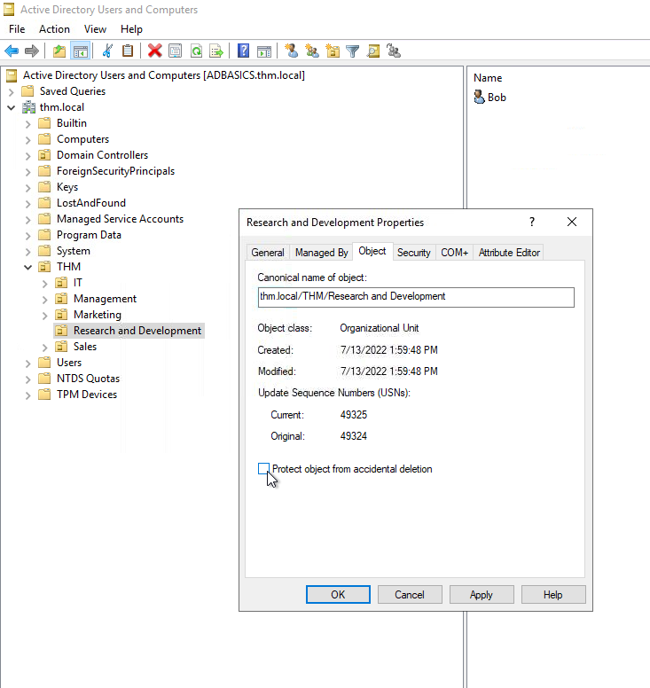
*Object tab showing the accidental deletion protection checkbox — unchecking this allows the OU to be deleted*

4. Clicked Apply → OK, then right-clicked the OU again → Delete → confirmed deletion

The OU and all objects inside it (including user **Bob**) were permanently removed.


*THM OU now shows only four department OUs — Research and Development has been removed*

---

### Task 3 — Synchronising Users to the Organisational Chart

After deleting the extra OU, reviewed the remaining department OUs against the provided organisational chart. Identified users that no longer existed in the business and removed them from the Sales OU.


*Confirmation dialog before deleting user Robert from the Sales OU*


*Confirmation dialog before deleting user Christine from the Sales OU*

Both deletions required confirmation via an Active Directory Domain Services warning dialog.

---

### Task 4 — Delegating Control Over the Sales OU

To follow the principle of least privilege, delegated password reset permissions over the **Sales OU** to user **Phillip** (IT support), rather than granting him full Domain Admin access.

**Steps performed:**

1. Right-clicked the Sales OU → **Delegate Control**

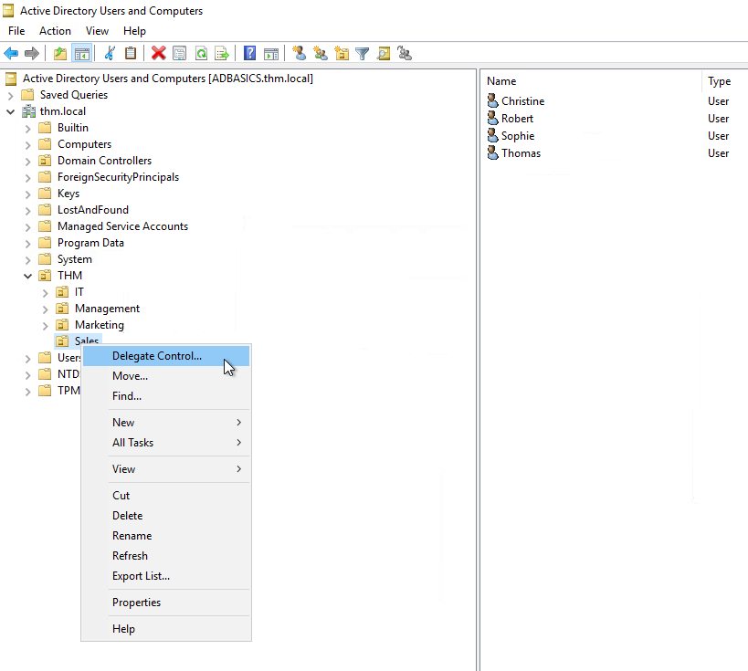
*Initiating the Delegation of Control Wizard on the Sales OU*

2. In the Delegation of Control Wizard, clicked **Add**, typed "phillip", and used **Check Names** to resolve the account


*Phillip's account resolved to phillip@thm.local using the Check Names function*

3. Selected the task: **"Reset user passwords and force password change at next logon"**

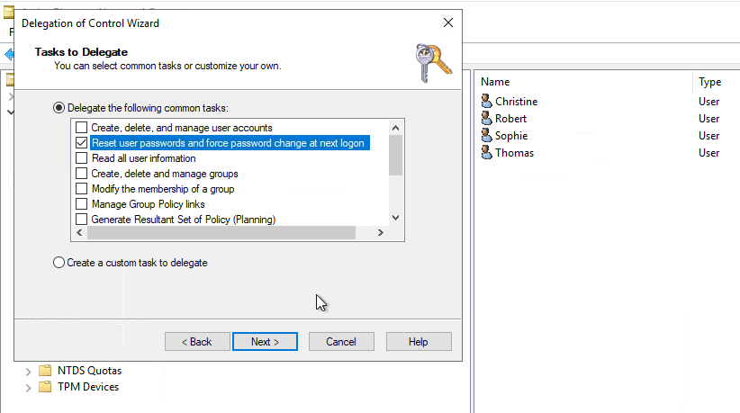
*Granting Phillip only the password reset permission — no other administrative rights*

4. Completed the wizard

This grants Phillip the specific ability to reset passwords in the Sales OU — and nothing more.

---

### Task 5 — Testing Delegation via PowerShell

Logged out of the Administrator account and connected via RDP as `THM\phillip` to verify the delegation was working correctly.

Since Phillip does not have access to open ADUC, used **PowerShell** to reset Sophie's password:

```powershell
# Reset Sophie's password
Set-ADAccountPassword sophie -Reset -NewPassword (Read-Host -AsSecureString -Prompt 'New Password') -Verbose

# Force Sophie to change her password at next logon
Set-ADUser -ChangePasswordAtLogon $true -Identity sophie -Verbose
```


*Running Set-ADAccountPassword as Phillip — verbose output confirms the operation was applied to Sophie's account*


*Running Set-ADUser with -ChangePasswordAtLogon — both commands completed successfully*

---

### Task 6 — Verifying the Password Reset as Sophie

Connected via RDP as `THM\sophie` using the newly set password.


*Connecting to the domain via RDP using THM\sophie credentials*

On first login, was immediately prompted:


*"The user's password must be changed before signing in" — the ChangePasswordAtLogon flag is working correctly*

After setting a new password, received confirmation:


*"Your password has been changed" — delegation and forced reset workflow verified end-to-end*

This confirms the `ChangePasswordAtLogon` flag was correctly applied via PowerShell. This is a standard helpdesk security practice — the helpdesk sets a temporary password, and the user is forced to set their own immediately.

---

### Task 7 — Organising Computers into OUs

Opened the default **Computers** container and reviewed the 10 machine objects present.

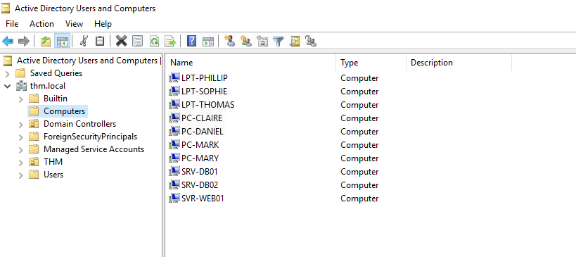
*Default Computers container showing all 10 machines before reorganisation — laptops (LPT), desktops (PC), and servers (SRV/SVR) mixed together*

| Machine | Type |
|---------|------|
| LPT-PHILLIP, LPT-SOPHIE, LPT-THOMAS | Laptops (Workstations) |
| PC-CLAIRE, PC-DANIEL, PC-MARK, PC-MARY | Desktop PCs (Workstations) |
| SRV-DB01, SRV-DB02, SVR-WEB01 | Servers |

Created two new OUs directly under the `thm.local` domain root by right-clicking the domain → New → Organizational Unit:

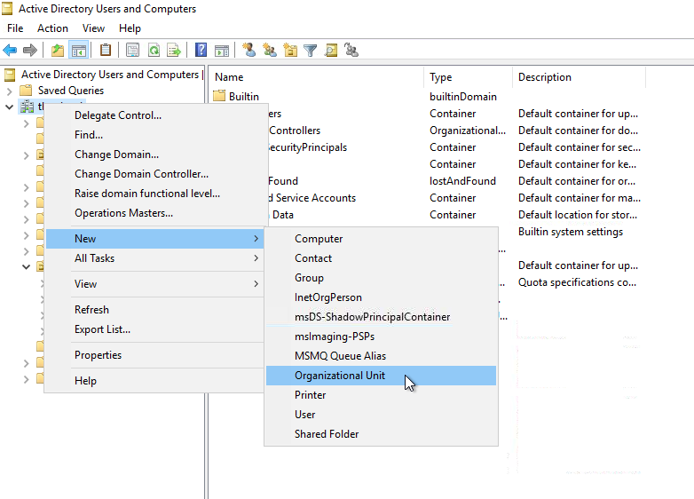
*Creating a new Organisational Unit directly under thm.local to separate workstations from servers*

Moved all 7 workstations to the Workstations OU and all 3 servers to the Servers OU.

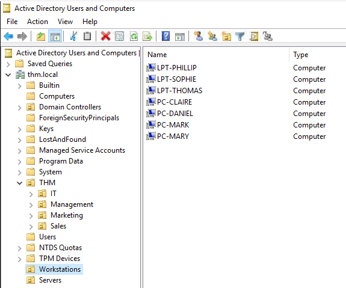
*Workstations OU containing 7 machines — 3 laptops and 4 desktop PCs*

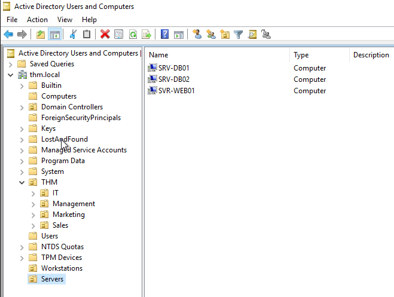
*Servers OU containing 3 servers — SRV-DB01, SRV-DB02, and SVR-WEB01*

This separation allows different GPOs to be applied to each category independently.

---

### Task 8 — Exploring Existing GPOs

Opened the **Group Policy Management** console and reviewed the three pre-existing GPOs.

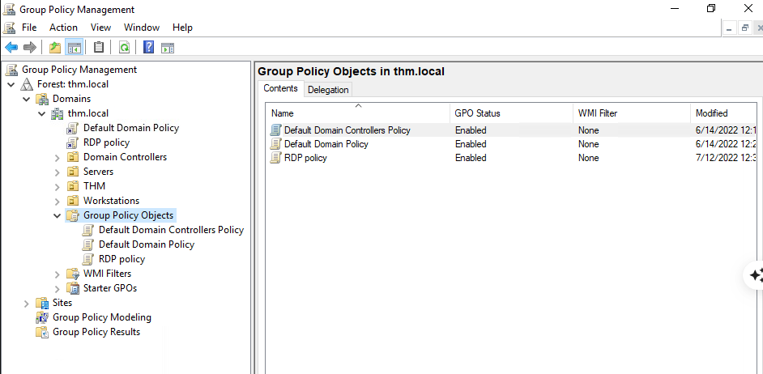
*Group Policy Management showing three existing GPOs: Default Domain Controllers Policy, Default Domain Policy, and RDP Policy*

| GPO | Linked To | Purpose |
|-----|-----------|---------|
| Default Domain Controllers Policy | Domain Controllers OU | Baseline settings for DCs |
| Default Domain Policy | thm.local (entire domain) | Domain-wide password and security policy |
| RDP Policy | thm.local | Controls Remote Desktop access |

Inspected the **Default Domain Policy** scope and confirmed it is linked to `thm.local` and applies to all Authenticated Users.

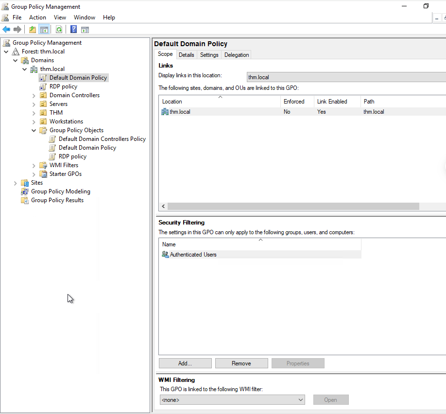
*Default Domain Policy scope — linked to thm.local and applying to all Authenticated Users*

Reviewed the Settings tab to inspect the current security configuration.

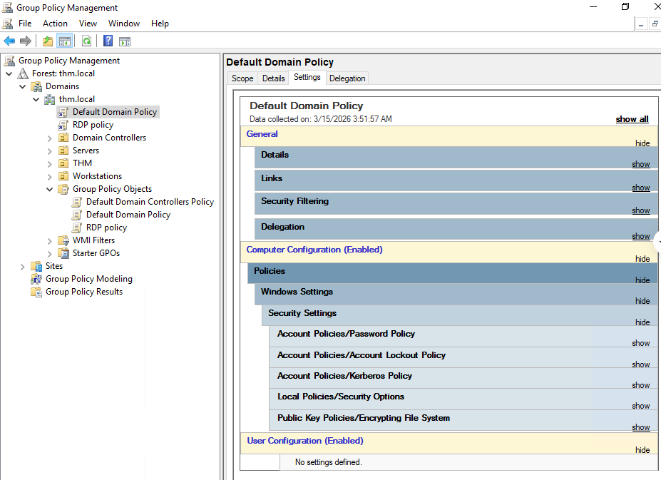
*Default Domain Policy settings showing Computer Configuration is enabled with no User Configuration defined*

Expanded the Password Policy section and observed the current values.

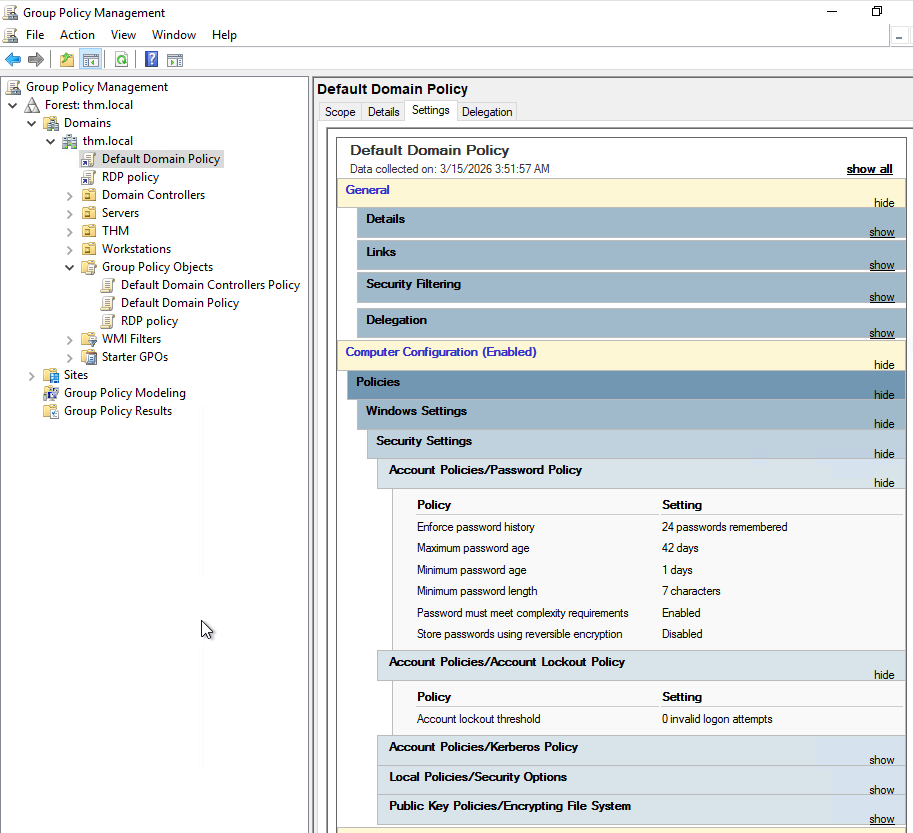
*Current password policy: 7-character minimum length, 42-day maximum age, complexity enabled*

Opened the GPO editor to inspect and modify the password length setting.


*Opening the GPO Management Editor via right-click → Edit*

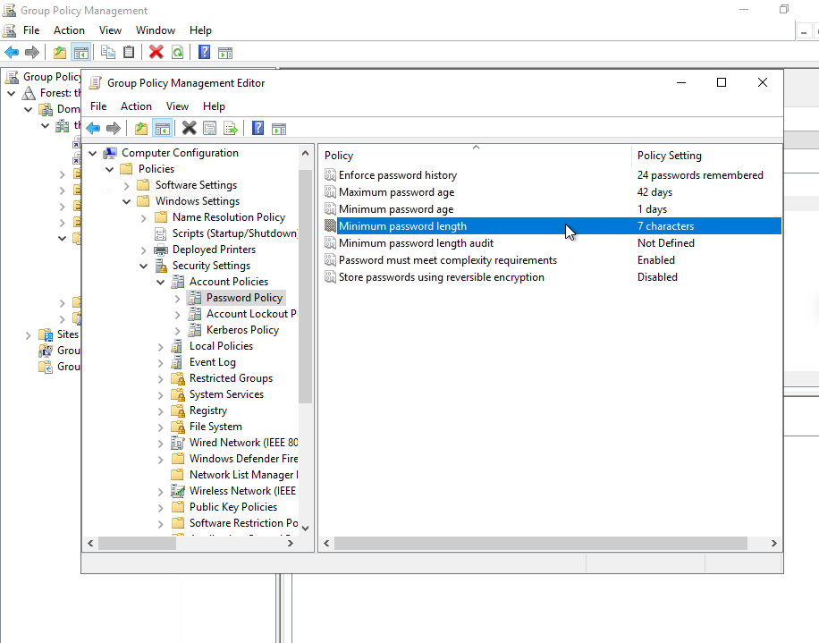
*GPO Management Editor showing the Password Policy — Minimum password length currently set to 7 characters*

---

### Task 9 — Creating the "Restrict Control Panel Access" GPO

Navigated to the Control Panel policy settings within the GPO editor.


*Navigating to User Configuration → Administrative Templates → Control Panel — "Prohibit access to Control Panel and PC settings" highlighted*

Enabled the **Prohibit access to Control Panel and PC settings** policy.


*"Prohibit access to Control Panel and PC settings" set to Enabled — this blocks Control.exe and SystemSettings.exe for affected users*

Created a new GPO named **Restrict Control Panel Access**.

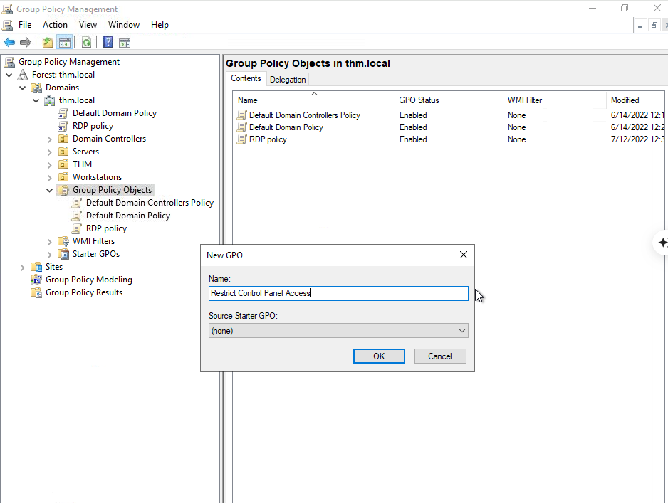
*Creating the new GPO "Restrict Control Panel Access" under Group Policy Objects*

Linked the GPO to the **Management**, **Marketing**, and **Sales** OUs. The **IT OU was intentionally excluded** — IT staff need Control Panel access to perform their work.

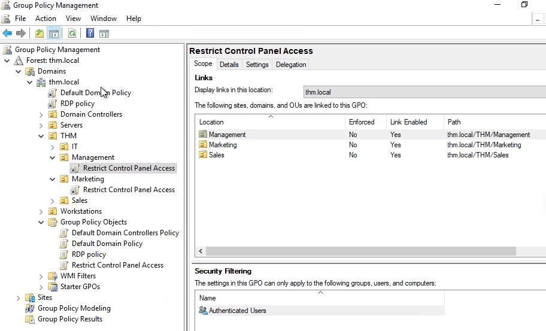
*GPO scope showing the Restrict Control Panel Access policy linked to Management, Marketing, and Sales — IT is excluded*

---

### Task 10 — Creating the "Auto Lock Screen" GPO

Navigated to the machine inactivity limit policy within the GPO editor.


*GPO Editor — Interactive logon: Machine inactivity limit under Local Policies → Security Options*

Set the inactivity limit to **300 seconds (5 minutes)**.

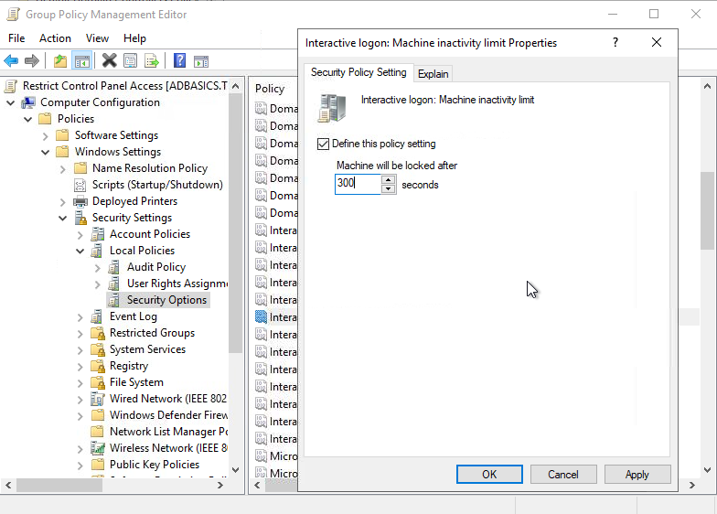
*Machine inactivity limit configured to 300 seconds — machines will lock automatically after 5 minutes of no user activity*

Linked the **Auto Lock Screen** GPO to the root domain (`thm.local`) so all child OUs inherit the policy through GPO inheritance.

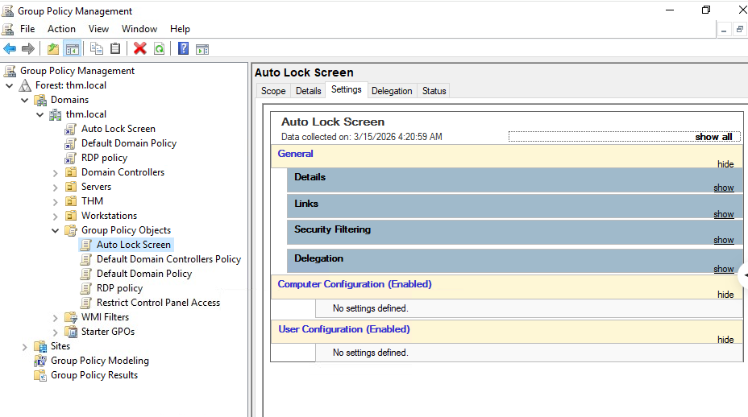
*Auto Lock Screen GPO created and linked to thm.local — visible in the Group Policy Objects list alongside existing policies*

---

### Task 11 — Verifying GPO Enforcement

Logged in as `THM\Mark` (a Marketing department user) and attempted to open Control Panel.

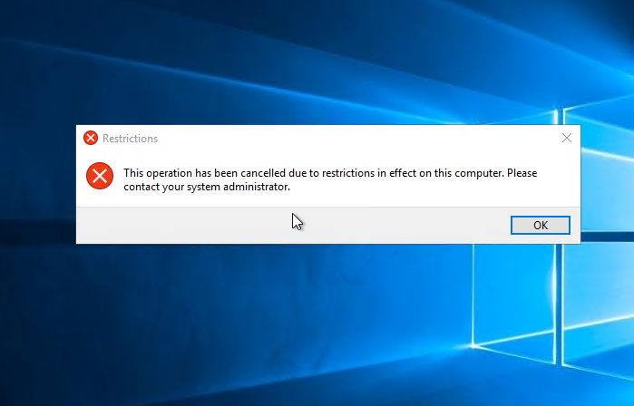
*"This operation has been cancelled due to restrictions in effect on this computer" — the Restrict Control Panel Access GPO is working correctly on Mark's account*

GPO enforcement confirmed. ✅

---

## Commands and Actions

```powershell
# Reset a user's password via PowerShell (run as delegated user Phillip)
Set-ADAccountPassword sophie -Reset -NewPassword (Read-Host -AsSecureString -Prompt 'New Password') -Verbose

# Force password change at next logon
Set-ADUser -ChangePasswordAtLogon $true -Identity sophie -Verbose

# Force immediate GPO update on a machine (run as Administrator if needed)
gpupdate /force
```

---

## Findings / Observations

- **Accidental deletion protection** is enabled on OUs by default — this is a good security hygiene practice that prevents unintended data loss. It requires deliberate steps to override, which creates an audit trail opportunity.

- **Delegation of control is powerful but needs careful scoping.** Giving Phillip password reset rights only over the Sales OU — not the entire domain — is a real-world application of the **principle of least privilege**. In a SOC context, overly broad delegations are a common finding in AD security audits.

- **PowerShell is the practical tool for delegated admins.** Phillip could not open ADUC (no GUI access), but PowerShell with the AD module gave him exactly the access he needed — no more. This is how helpdesk accounts are often configured in enterprise environments.

- **The Default Domain Password Policy only had a 7-character minimum** — below current NIST and CIS benchmark recommendations (minimum 12–14 characters). This is a realistic finding in older enterprise environments and would be flagged in a security audit.

- **GPO inheritance means root-level policies affect all child OUs.** This is efficient for broad policies like screen lock timers, but requires careful thought — a misconfigured root GPO can unintentionally affect the entire domain.

- **SYSVOL is the distribution mechanism for GPOs.** All domain machines must have read access to SYSVOL to receive their GPO updates. In a threat context, SYSVOL has historically been a target for credential exposure via scripts stored in Group Policy Preferences.

---

## Skills Demonstrated

- Navigating and administering Active Directory Users and Computers (ADUC)
- Creating, configuring, and deleting Organisational Units
- Managing domain user accounts (create, delete, modify)
- Applying the principle of least privilege through Delegation of Control
- Using PowerShell AD cmdlets (`Set-ADAccountPassword`, `Set-ADUser`) for account management
- Creating and linking Group Policy Objects (GPOs) to enforce security baselines
- Reading and interpreting existing GPO settings and scope
- Organising computer objects by function (workstations vs. servers)
- Verifying policy enforcement by testing as a standard user account

---

## Lessons Learned

The biggest takeaway from this lab was understanding the **difference between what you can do and what you should do** in Active Directory. It would be technically possible to give Phillip Domain Admin rights to let him reset passwords — but that would be a serious security risk. The delegation model exists precisely to avoid that.

I also found the GPO inheritance model interesting from a SOC perspective. A misconfigured GPO at the root domain level could silently affect every machine in the organisation — which is why GPO changes should always be tested in a limited scope before being applied broadly.

The accidental deletion protection on OUs was something I had not considered before. It is a simple feature, but in a real environment, removing a populated OU by mistake could mean losing hundreds of user objects. Understanding why that protection exists — not just how to disable it — is the kind of operational awareness that matters in IT support and security roles.

---

## Conclusion

This lab provided practical exposure to the core administrative tasks performed daily by IT support and systems administrators in enterprise Windows environments. By working through user management, delegation, GPO creation, and computer organisation, I developed a foundational understanding of how Active Directory is structured and maintained.

From a cybersecurity perspective, the concepts covered here — AD object management, least privilege, policy enforcement, and authentication protocols — are directly relevant to understanding common attack surfaces in enterprise environments. Active Directory misconfigurations remain one of the most frequently exploited vectors in real-world intrusions, making this foundational knowledge essential for any aspiring SOC analyst.

---

> 📁 This write-up is part of my [Security Analyst Journal](https://github.com/beatrizmartinsc) — a hands-on cybersecurity learning portfolio documenting practical labs, tools, and concepts relevant to entry-level SOC and cybersecurity analyst roles.
